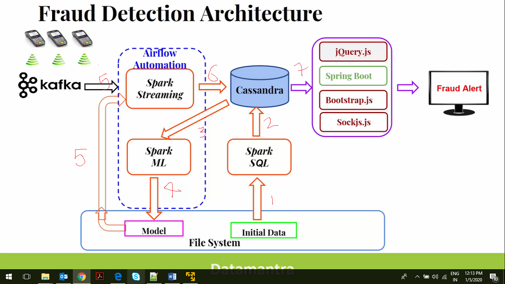
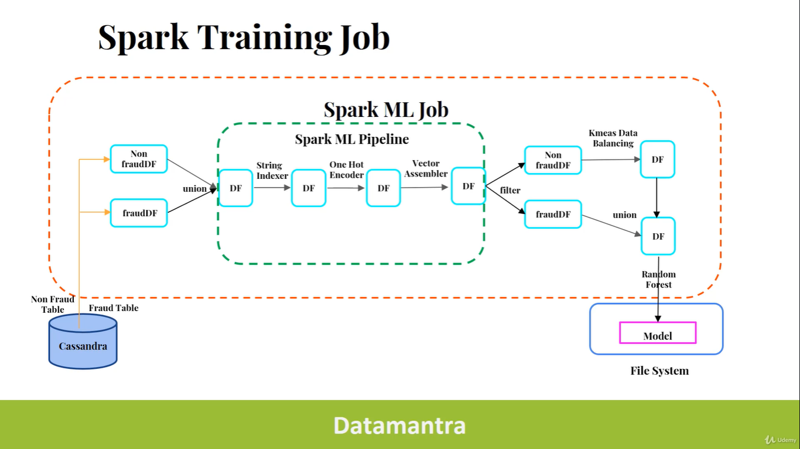
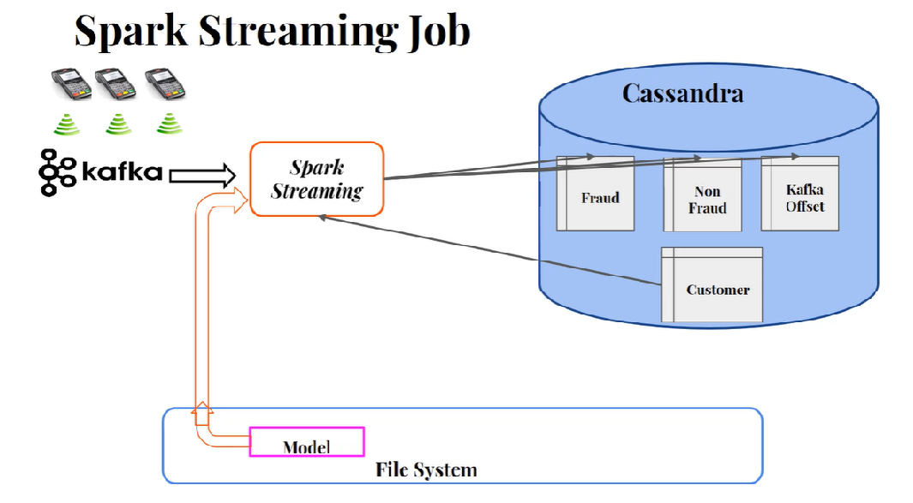

# FraudDectectionApp

# Credit Card Fraud Detection : APPLICATION COMPONENTS

There are 6 Components:
1. Fraud Detection Core Application (FraudDetection)
2. Real Time Transaction Simulator  (CreditcardProducer)
3. Alert Dashboard (Fraud-alert-dashboard)
4. Airflow Automation and Spark Job Scheduler (Part of FraudDetection > automate folder ---> Not Covered)
5. Cassandra DB & Cassandra UI 
6. Zookeeper & Kafka Message Broker  


# SETUP
1. Git Pull for three Repositories : FraudDetection,CreditcardProducer,Fraud-alert-dashboard

2. Before starting Jobs we need to have Cassandra in place, here are the steps:
- docker pull datastax/dse-server:5.1.5 (Pull Casssandra Image)
- docker pull datastax/dse-studio:latest (Pull Cassandra Studio Image (Web GUI) )
- docker run -p 9042:9042 -e DS_LICENSE=accept --memory 4g --name my-dse -d datastax/dse-server:5.1.5 (Run Cassandra container)
- docker run -e DS_LICENSE=accept --link my-dse -p 9091:9091 --memory 1g --name my-studio -d datastax/dse-studio
 (Run Cassandra Studio)
-  Connect to Cassandra Studio: http://localhost:9091/  > Go to Tab "Working with CQL 6.0.0" > Test Connection change host name to my-dse and Test & Save. 
- In Studio : Create Key Space and Tables using : creditcard.sql (FraudDetection/src/main/resources/cassandra/creditcard.cql). Alternatively import Notebook  FraudDetection_Notebook.tar (present in FraudDetection folder).
- 4 Tables are created : customer, fraud_transaction, non_fraud_transaction, kafka_offset

 3. Move to   Project > Fraud-alert-dashboard :
   a. Run Fraud-alert-dashboard/src/main/java/com/datamantra/fraudalertdashboard/dashboard/FraudAlertDashboard.java
   b  Open localhost:8080 (You'll see dashboard without data since we have not pushed data in Cassandra - we will do it next)

 4. Now move to Project > FraudDetection and run the requiered jobs as explained below:
  a. Job1: FraudDetection/src/main/scala/com/datamantra/spark/jobs/IntialImportToCassandra.scala (Load data in customer, fraud_transaction, non_fraud_transaction tables)
  b. Job2: FraudDetection/src/main/scala/com/datamantra/spark/jobs/FraudDetectionTraining.scala (Create 2 Models PreprocessingModel & RandomForestModel @ FraudDetection/src/main/resources/spark/training using Spark ML)
  c. Job3 : To run DstreamFraudDetection.scala > first we will setup Kafka and then run the Job:
     i.  git clone https://github.com/wurstmeister/kafka-docker
	 ii. Replace the code in kafka-docker > docker-compose.yml with:
	 
	   ```
		    version: '2'
			services:
			  zookeeper:
				image: wurstmeister/zookeeper
				ports:
				  - "2181:2181"
			  kafka:
				build: .
				ports:
				  - "9092:9092"
				environment:
				  KAFKA_ADVERTISED_HOST_NAME: 127.0.0.1
				  KAFKA_CREATE_TOPICS: "creditcardTransaction"
				  KAFKA_ZOOKEEPER_CONNECT: zookeeper:2181
				volumes:
				  - /var/run/docker.sock:/var/run/docker.sock
		
iii.  Go to folder kafka-docker and run docker-compose up -d  (This will run Zookeeper, Kafka @ 9092  with the topic "creditTransaction" alreday created)
iv. Now run the Streaming Job which will listen to Kafka Topic : FraudDetection/src/main/scala/com/datamantra/spark/jobs/RealTimeFraudDetection/DstreamFraudDetection.scala
	  v. Note: This will not get any messages yet since the Kafaka Topic is empty.Next we will populate the topic with data.
	  
 5. Move to Project > CreditcardProducer
    a. Run with Configurtaion: CreditcardProducer/src/main/scala/com/datamantra/producer/TrasactionProducer.scala : src/main/resources/application-local.conf (in Program Arguments)
	
 6 This above step starts pushing transaction data into kafaka from where the DstreamFraudDetection Job will start consuming messages and work with generated Models and push data back to Cassandra after predictions.
 
 7. Check Dashboard: Now you'll also see the Dashboard being populated with the Fraud Transaction Records.
      	  
 


# What does the ApP DO? 

  1. Initially we have 2 Data Sets - Customer and Transactions Tables. These Transaction table is having all the Fraud & Non Fraud Data classified based on Actuals (Not Predicted)
  2. Customer is stored directly in Cassandra Customer Table while Transcation is Split into 2 Tables Fraud-Txn and Non-Fraud Txn(Age & Distance fields are added in both Txn Tables using help of Customer Table)
  3. The above 2 Transaction Tables are used for Predictions Only. The Model is Created Using  these Transaction Tables
  4. The Realtime TRANSACTIONS are then checked and validated using this Model and basis prediction goes to one of them.
  5. The Fraud Predictions are displayed on Dashboard using the Fraud  Transcation Prediction Table.
  6. Note: These are just predictions once actuals are confirmed the INtiall Transaction data is again used to create Model - so to have robust and slowly trained Model. This is what would the Airflow automation script would help us do (to an extent)
  7. The Ideal situation would be when the Predicted Fraud Transactions and Actually Fraud (or to nearest accuracy) 
  
  Limitations:
  1. The Predication Tables are not seprated out from Actual Tabels. Ideally, once the predictions are validated they shoul move back to the main/actual db.
  2. After moving the validated predictions to the Actual DB - peredically the model should be re-generated from the Actual data and then same cycle shuld start. 
 
 
 
 # ML FLOW

.png)
 
  StrinIndexer - 1st Stage of Pipeline 
  This will transform all the selected columns into Double Values because the ML Algo will not understand String Values but Only Doubble Values
 
  
  OneHotEncoder - 2nd Stage of Pipeline 
  This will normalize the Double Values (generated by StringIndexer) 
  
  
   VectorAssembler - 3rd Stage of Pipeline 
   This will assemble all the transformed columns into ONE Coloumn - this column is called FEATURE COLUMN and the Value of this column is an Vector.
   This FEATURE COLUMN will enable us to Train ON this Data Frame and  will be served as an input to the Model Creation Algorithm.
  
   But Training on this Data Frame will not be accurate as the Data is NOT Balanced. Which means The number of Fraud records are too less than Non-fraund.
   This is where K-MEANS Algo comes into play. 
   
   //IMP
   However, please note: till this point a Preprocessing Model is generated and saved.[This is used by Realtime data to produce Feature or data Transformation.]
   After K-MEANS and  Random Forest flow below the final Random Forest Model will also be saved. [This is used for Predictions of Realtime Data]
  
  
   How would K-Means Work here?   This will basically reduce the Normal (Non-Fraud) Transactions as explained below (Check the Diagram):
  1. The output of Vector Assembler i.e. FETAURE COLUMN is split  into 2 Data Frames - NON-FRaud and FRaud.
  2. The Non-Fraud DF will be the first input to K-MEANS (which basically needs to be reduced)
  3. Second Input to KMEANS is No. of CLUSTERED CENTROID = No of Fraud Transactions
  4. Now K-MEANS will group all the non-fraud transactions into these centroids. As a result the no. of non-fraud transactions are reduced to No. of FRaud Transactions. 
  5. Now COmbine the FraudTransactions DF with the above Non-Fraud transformed DF and this becomes a Balanced DF.
  6. Now apply Random Forest Algo on Balaced DF. The Random Forest will train on this data and create a Model and saved to File System.
  
  
# Runtime Streaming

   
  This is SPark Streaming Job and a Consumer of Kafka Topic genertaed by the Simulator. We devide it in 2 parts
 
 Part 1- Consuming Streams from Kafka
  1. Read Customer Data from Cassandra
  2. This will be used to calulate Age & Distance (between Customer and Merchant place using bot partys LAt & Long). These will also be used as Feature columns in ML.
  3. After that we load both the Models (Preprocessed & Random Forest)stored in File System (generated by Initial Data). 
  4. The Realtime Data is first run tgrough Preprocessed Model for Transfrmation (Feature Gneration) & Then Random Forest Model for Prediction.
  5. Based on Prediction The Fraud Txn will be saved in Fraud Txn Table and Non-Fraud in Non-Fraud Trx Table.
  6. Apart from that Kafka Offsets will also be sprately Stored in KafKa Offset Table - This is to achieve EXACTLY-ONCE SEMANTICS  
  7. For achieving this CassandraConnector is Used. This is a seralializable Object and is pushed to all Spark Executors from Spark Driver for storing the Predictions and Kafka-OffsetValues into Cassandra.
  8. CassandraConnector automaticlaly handles the connection details and persists the data.
  9. Next pusblish the Connection Configurations to all Executors using Brodcast Variables which wil be read by the CassandraConnector before inserting data.
  10. Now - Every 5 seconds the Streaming Job is scheduled - i.e. it would read data from kafka after every 5 seconds (batch interval)
  11. After this Initialize Kafaka Consumer Configurations like group-id auto-offset-rest etc.
  12. Next we connect to direct kafka stream and the app starts reading messages from kafka. Offset is used to ensure we dont read already read messages when this streaming application is re-started.
  
  Part 2 - Processing Transactions and Saving Predctions
  1. The dstream contains 3 things : i) value = all the transaction messages in 5 second interval (ii) partition (iii) offset (Note offset is per partition)
  2. Then ALL the incoming messages contained in DsTREAM RDD are processed first with Prepprocessor Model and than the Feature Column genertaed is passed  into the Random Forest transformation to Predict whether the given message in Fraudant or not.
  3. Now through CassndraConnetor using prepared statements insert the Fraudant records in Fraud Txn Table and Non-Fraud in Non-Fraud Txn Table and finally update Offeset in Ke-offset Table after each insertion.
